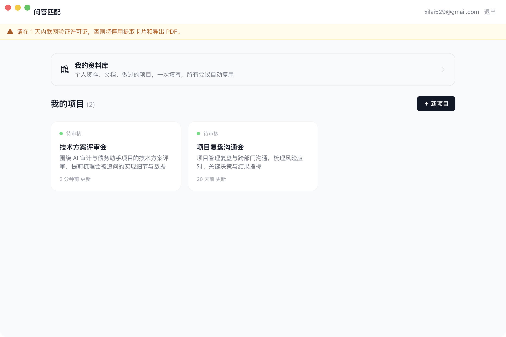
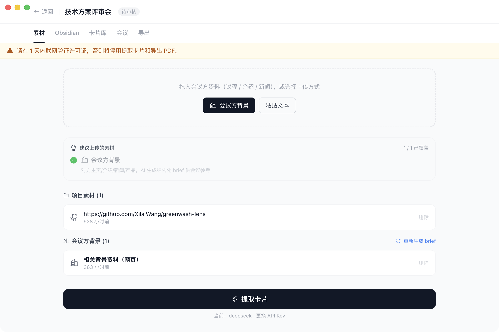
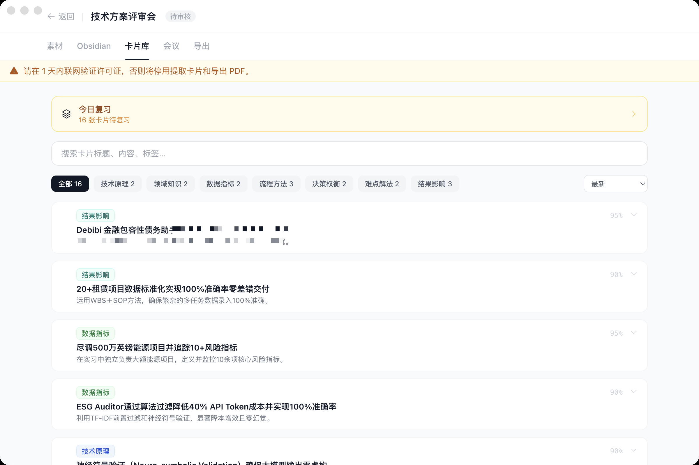
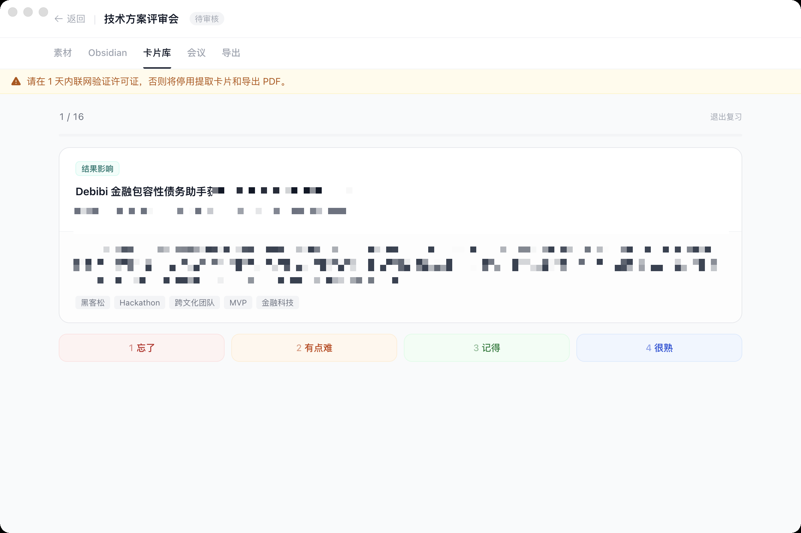
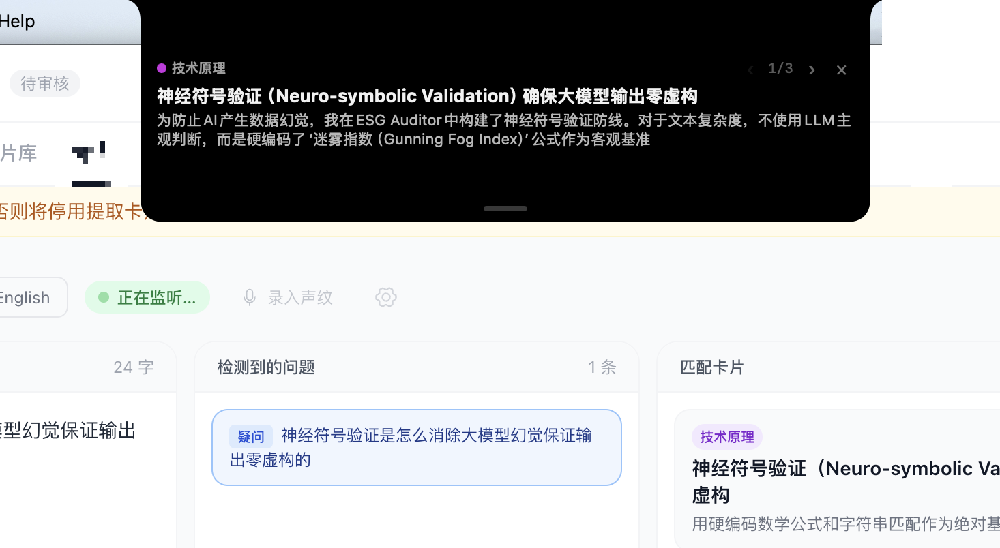
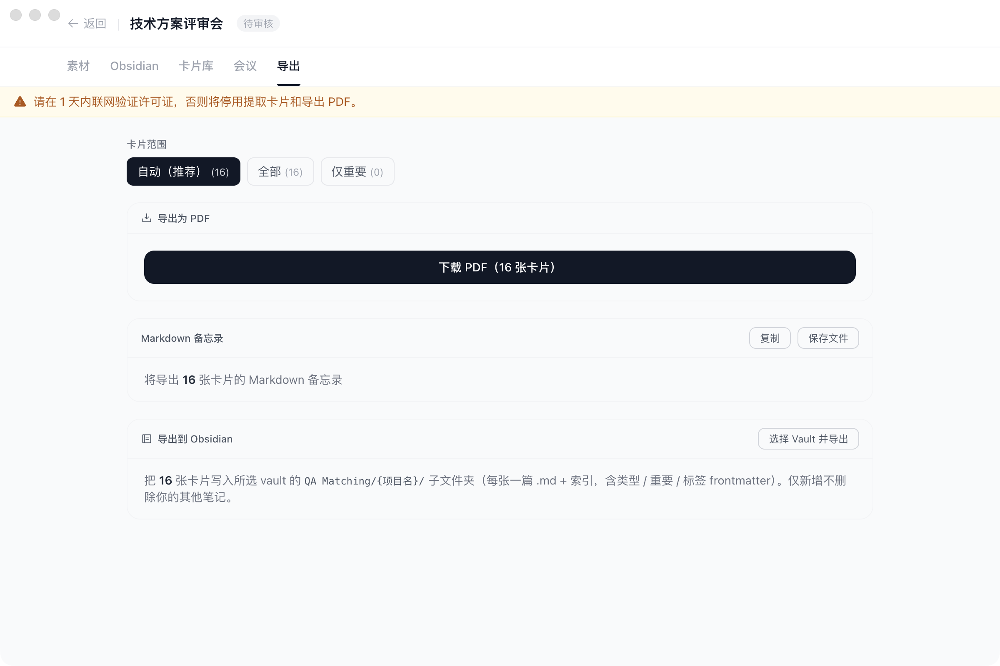

<div align="center">

# Meeting Recall Copilot · 会议回忆助手

**Bring everything you prepared back to your eyes — the instant you're asked.**

**把你准备过的一切，在被问到的那一刻，重新递到你眼前。**

</div>

---

> It's the project review. You built this — every line, every decision was yours.
> Then someone asks: *"How exactly did you keep the error rate at zero?"*
> You **know** the answer. It's in a doc somewhere. But you can't flip to it mid-sentence.
> Your mind goes blank for three seconds that feel like three minutes.
>
> 项目评审会上。这东西是你做的——每一行、每一个决定都出自你手。
> 然后有人问：*「你到底是怎么把差错率压到零的？」*
> 你**知道**答案。它在某个文档里。但你没法在说话中途翻出来。
> 大脑空白了三秒，却像过了三分钟。

**Meeting Recall Copilot is built for those three seconds.** It doesn't speak for you and it doesn't make things up — it simply hands you back what you already prepared, the moment you need it.

**会议回忆助手就是为这三秒做的。** 它不替你说话、也不替你编造——它只是在你需要的那一刻，把你早已准备好的内容重新递到你眼前。

---

## What it does · 它做什么

A **local-first** macOS app with two halves:

一款**本地优先**的 macOS 桌面应用，分两半：

- **Before the meeting** — drop in your materials (docs, slides, a GitHub repo, an Obsidian vault), and an LLM distills them into structured **memory cards** you can search and space-repetition review.
- **会议前** —— 把你的资料(文档、PPT、GitHub 仓库、Obsidian 库)丢进来，LLM 把它们提炼成结构化的**记忆卡片**，可全文搜索、可间隔复习。

- **During the meeting** — it listens to the *other side* in real time, detects their question, runs a hybrid search over your cards, and surfaces the best match on a glanceable **floating overlay** near your camera.
- **会议中** —— 它实时听**对方**说话，检测对方的提问，在你的卡片库里做混合检索，把最相关的那张推到摄像头旁一个低头一瞥就能看到的**悬浮提词窗**。

```
Before the meeting · 会议前              During the meeting · 会议中
─────────────────────────              ──────────────────────────────────────────
materials                              the other side speaks
素材                                    对方说话
   │  upload · 上传                         │  system audio · 系统音频
   ▼                                        ▼
AI extracts 7 card types               real-time transcription · 实时转译
AI 提取 7 类卡片                            │
   │                                        ▼
   ▼                                     question detection · 提问检测
spaced-repetition review                   │
间隔复习记忆                                 ▼
                                        hybrid retrieval (FTS5 + vector + RRF)
                                        混合检索(词法 + 语义向量 + RRF 融合)
                                           │
                                           ▼
                                        matched card → floating overlay
                                        命中卡片 → 悬浮提词窗
```

---

## See it · 看一看

> Screenshots from the development build (macOS). Some personal details are blurred.
> 截图来自开发版桌面应用(macOS)，部分个人信息已打码。

### Home · 主页 — your personal corpus, reused everywhere · 一处录入，处处复用

Record your personal materials once (bio, docs, past projects); every meeting space reuses them. Each topic gets its own space — clone or delete freely.

个人材料(履历 / 文档 / 过往项目)一次录入，所有会议场景自动复用；每个主题单独建一个空间，支持复制与删除。



### Materials · 素材 — guided upload + auto brief · 上下文引导 + 自动 brief

Upload background by context (agenda / the other side's homepage / news) and auto-generate a structured brief. Sources: GitHub, ZIP, documents, web pages, plain text, Obsidian vaults.

按会议上下文引导上传背景情报(议程 / 对方主页 / 新闻)并自动生成结构化 brief；支持 GitHub、ZIP、文档、网页、文本、Obsidian 库等多种来源。



### Card library · 卡片库 — 7 card types + full-text search + FSRS review · 7 类知识卡 + 全文搜索 + FSRS 复习

The LLM extracts 7 typed cards (result/impact, metrics, technical principle, …) with confidence scores, starring, full-text search, and spaced-repetition.

LLM 把素材提取成 7 类记忆卡片(结果影响 / 数据指标 / 技术原理 等)，带置信度、标记重点、全文搜索、间隔复习。



### Spaced review · 间隔复习 — FSRS scheduling · FSRS 记忆排程

Due cards enter review: see the question, reveal the answer, rate by recall difficulty; FSRS schedules the next review so the knowledge actually sticks.

到期卡片进入复习模式：先看问题、再「显示答案」，按记忆难度评分，FSRS 自动安排下次复习时间，让知识真正留在脑子里。



### Live copilot + floating overlay · 会议实时助手 + 悬浮提词窗

Three panes in real time — the other side's speech (left), detected questions (middle), matched cards (right) — plus a system-level floating overlay (the dark notch) that hovers above your screen near the camera. Look up at the lens and the prompt is already there; your own mic is shown but never triggers a match.

三栏实时联动——对方发言(左)、检测到的提问(中)、匹配卡片(右)——加上一个系统级悬浮提词窗(那张深色 notch)浮在屏幕上方、贴近摄像头。抬头看镜头，提词已经在那；你自己的麦克风只展示、绝不触发匹配。



### Export · 导出 — PDF / Markdown

Export a cheat-sheet PDF (minimal / modern templates) or a Markdown memo, by scope (smart / all / starred-only).

按范围(智能 / 全部 / 仅重点)导出速记 PDF(简约 / 现代模板)或 Markdown 备忘录。



---

## Three design decisions that matter · 三个关键设计

These are the parts I'd defend in a design review.

这三点是我在设计评审里会重点为它辩护的。

**1. It ignores your own voice — on purpose.** Only the *other side's* audio (the system-audio tap, or a single-mic voiceprint gate) drives matching. When you talk, nothing fires. Without this, you'd spam yourself with cards every time you opened your mouth — so "stay silent when it's you talking" is a feature, not a gap.

**1. 它故意不理你自己的声音。** 只有**对方**的声音(系统音频 tap，或单麦声纹门控)会驱动匹配；你一开口，什么都不弹。没有这条，你每说一句话都会被自己刷屏——所以「是你在说话就不出卡」是设计，不是缺陷。

**2. Local-first + BYOK.** Your cards and materials live 100% in local SQLite. You bring your own LLM key (Claude / GPT / Qwen / DeepSeek); it's encrypted via the OS keychain and never leaves your machine. The thin cloud backend only does what *can't* live locally — accounts, licensing, a metered cold-start proxy.

**2. 本地优先 + BYOK(自带密钥)。** 你的卡片和素材 100% 留在本地 SQLite；LLM 用你自己的 key(Claude / GPT / Qwen / DeepSeek)，经系统钥匙串加密、绝不出本机。极薄的云端只做那些**不能**放在本地的事——账号、授权、冷启动免费额度代理。

**3. Glanceable, not intrusive.** The overlay is a native `NSPanel` at screen-saver level: it floats above fullscreen apps, stays across Spaces, never steals focus, merges with the notch — and can be hidden from screen recording / sharing. You glance up; the room sees nothing.

**3. 一瞥即得，毫不打扰。** 浮窗是 screen-saver 级的原生 `NSPanel`：浮在全屏应用之上、跨 Space 常驻、不抢焦点、与刘海融合——还可对录屏 / 共享隐身。你抬头就看到，别人什么都看不到。

---

## Tech stack · 技术栈

| Layer · 层 | Tech · 技术 |
|---|---|
| Desktop · 桌面 | Electron 34 + React 18 + TypeScript + Tailwind CSS |
| Build · 构建 | electron-vite + electron-builder |
| State · 状态 | Zustand + TanStack Query |
| Local DB · 本地库 | Drizzle ORM + better-sqlite3 (local-first SQLite) |
| Speech · 语音 | macOS native SFSpeechRecognizer (on-device, streaming) + Web Speech fallback |
| Question detection · 提问检测 | local lexical heuristics, BYOK-LLM fallback on ambiguity |
| Hybrid retrieval · 混合检索 | SQLite FTS5 (lexical) + sqlite-vec (e5-small vectors) + RRF fusion |
| Card extraction · 卡片提取 | BYOK (Claude / GPT / Qwen / DeepSeek) |
| Parsers · 解析 | PDF, DOCX, PPTX, GitHub URL, ZIP, Obsidian vault |
| Backend · 后端 | Hono + Node.js + PostgreSQL (Fly.io) |
| Auth · 认证 | JWT + Argon2id (bcryptjs verifies legacy hashes) + license system |

---

## Quick start · 快速开始

**Prerequisites · 前置条件:** Node.js ≥ 20 · pnpm ≥ 9 · Docker (for local PostgreSQL)

```bash
pnpm install

# Backend · 后端
cd apps/backend
cp .env.example .env          # fill JWT_SECRET + DATABASE_URL · 填写密钥
docker compose up -d
pnpm db:migrate
pnpm dev

# Desktop (dev) · 桌面端(开发模式)
cd apps/desktop
pnpm rebuild                  # rebuild better-sqlite3 for Electron
pnpm dev

# Package as a macOS app · 打包为 macOS 应用
pnpm dist                     # → dist/mac-arm64/*.app
```

The desktop app has no `.env`: every LLM API key is encrypted with Electron `safeStorage` (macOS Keychain / Windows DPAPI / Linux Secret Service) and stored as ciphertext in local SQLite — plaintext never touches disk.

桌面端没有 `.env`：所有 LLM API key 经 Electron `safeStorage`(macOS 钥匙串 / Windows DPAPI / Linux Secret Service)加密后，密文存于本地 SQLite，明文不入库。

---

## Project structure · 项目结构

```
qa-matching/
├─ apps/
│  ├─ desktop/                  # Electron app · 桌面应用
│  │  └─ src/
│  │     ├─ main/               # main process: DB, IPC, parsers, LLM, retrieval
│  │     │  ├─ db/              # Drizzle schema + migrations
│  │     │  ├─ ipc/             # IPC handlers
│  │     │  ├─ lib/             # parsers, LLM, hybrid-retrieval engine, PDF
│  │     │  └─ swift/           # native ASR / voiceprint gate / overlay helpers
│  │     ├─ preload/            # typed contextBridge surface
│  │     └─ renderer/           # React UI (pages / tabs / stores)
│  └─ backend/                  # Hono API · auth / llm-proxy / survey / license
├─ packages/shared/             # shared Zod schemas + types · 前后端共享
├─ docs/                        # planning docs + screenshots · 规划文档
├─ CLAUDE.md                    # AI-assistant context · AI 编程助手必读
└─ CONTRIBUTING.md              # engineering rules · 工程规范
```

---

## Engineering discipline · 工程纪律

A solo project, run like a team one — because the product is *"remember what you built with AI,"* and the worst irony would be code I couldn't explain.

一个个人项目，按团队的标准来做——因为这个产品讲的就是「记住你用 AI 做出来的东西」，而最大的反讽莫过于写出自己看不懂的代码。

- Every AI-written key function carries a `// Why:` comment (the intent, not the what).
  每个 AI 写的关键函数都带 `// Why:` 注释(写"为什么"，不写"做什么")。
- Core modules are unit-tested; typecheck + lint + tests gate every commit (husky) and every push (CI).
  核心模块有单测；typecheck + lint + 测试在每次提交(husky)和每次推送(CI)处把关。
- Architecture decisions are written by hand into decision logs, never ghostwritten by AI.
  架构决策手写进决策日志，不交 AI 代笔。

---

## License · 许可

Proprietary — Meeting Recall Copilot © 2026 Xilai Wang.
专有软件 —— 会议回忆助手 © 2026 Xilai Wang。
